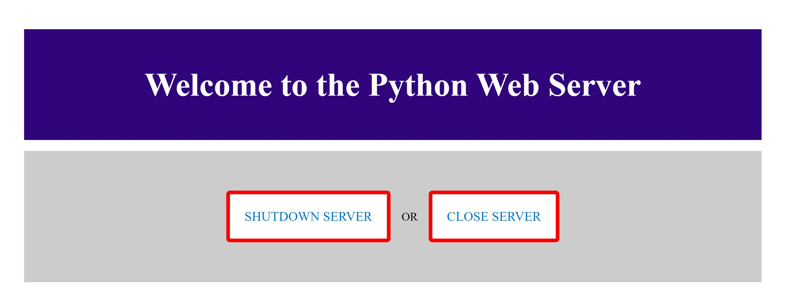

# AssignMent1: Web Server
This project includes a simple Python-based web server that can serve HTML files from a designated directory and allows for remote shutdown through specific URLs.
## Project Structure

- `my_web_server.py`: The main Python script for the server.
- `htdocs/`: Directory containing HTML files that can be served by this server.
  - `index.html`: Main page.
  - `shutdown.html`: Accessing this page will shut down the server.
  - `close_server.html`: Another page that can also shut down the server.
#### Image

## Setup Instructions

1. **Prerequisites**: Ensure you have Python installed on your system.
2. **Download the project**: Clone or download the ZIP file and extract it to a local directory.
3. **Running the Server**:
   - Navigate to the project directory in a terminal or command prompt.
   - Run the command: `python my_web_server.py`
   - The server will start and listen for connections on port 8080.

## Using the Web Server

- Open a web browser and go to `http://localhost:8080` to access the `index.html` page.
- You can shut down the server by navigating to `http://localhost:8080/shutdown.html` or `http://localhost:8080/close_server.html`.

## Features

- The server serves a static HTML content.
- Includes basic error handling for 404 (Not Found) and 500 (Internal Server Error).
- Allows the server to be shut down remotely via specific HTML pages.

## Future Enhancements

- Add support for other content types like CSS, JavaScript, and images.
- Implement better security measures for server shutdown functionality.
- Extend functionality to handle POST requests and other HTTP methods.

## CREATED BY
1. Name: [Mugisha Ivan Jalagatha] 
2. Email: [jalagatha@gmail.com]
3. RegNo: [2024/HD05/22104U]
4. Pr0gram:[MDSE SE-Option]
   
## Program Facilitator 
1.Name:[Dr. Eyabu]
2.College:[Makerere University]

